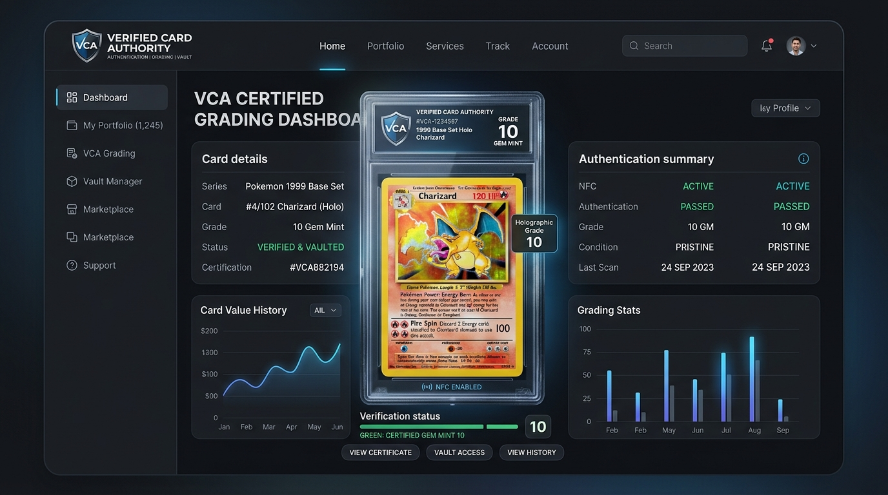
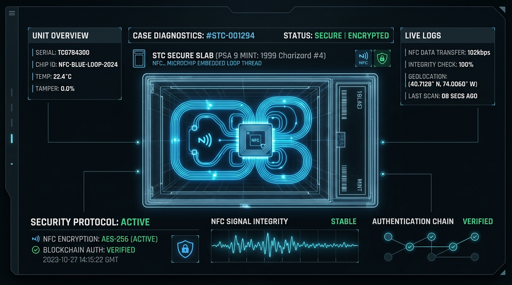
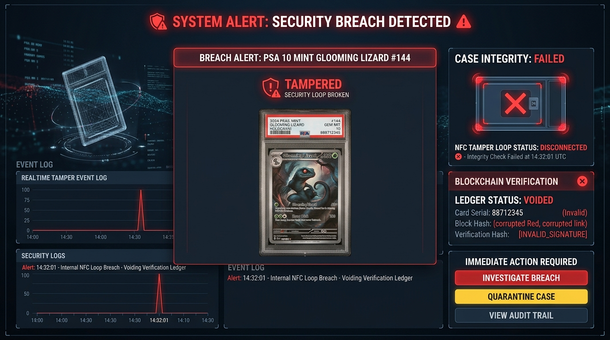

# Verified Card Authority (VCA)


*Above: The VCA Card Authentication platform overview and interactive graded slab view.*

**Verified Card Authority (VCA)** is revolutionizing the collectible grading industry by introducing the world's first **Active NFC Cryptographic Seal**. We provide absolute integrity, immutable registry tracking, and tamper-proof security for high-value collector items (TCG, Sports Cards, and more).

## Leading the Industry with NFC Technology

At VCA, we are setting a new standard for collectible security and leading the industry by closing the loop on high-value collectible fraud. Our target audience encompasses high-end auction houses, institutional vaulting services, elite collectors, and trading card authentication platforms who demand zero-trust asset verification.

Even if card cases are perfectly reconstructed physically by bad actors, their digital ledger keys are severed permanently upon any physical opening. We are replacing subjective visual-only authentication with undeniable, mathematically backed cryptographic proof.


*Above: Passive NFC Microchip loop architecture protecting the sonic-welded slab.*

Our proprietary case architecture integrates physical airtight chemical sensors with passive microchip circuits:

### 1. NFC Microchip Loop Thread
A microscopic continuous loop trace runs inside the sonic-weld lining of the VCA holder. It acts as an electronic tamper indicator. Prying, cutting, or drilling severs this path permanently.

### 2. Passive, Battery-Free Energy
The security circuit is passive and does not rely on an integrated battery. It dynamically harvests RF energy from the scanner device (smartphone or handheld reader) when placed nearby.


*Above: Live tamper simulation demonstrating an immediate breach alert and ledger invalidation.*

### 3. Photochromic VCA Black-out Foil
If the airtight seal is broken, the internal holographic "VCA" watermark undergoes oxygen-induced photochromic oxidation. It changes permanently from a shimmering rainbow color to solid carbon black.

### 4. Cryptographic Ledger Record
Each successful scan is cross-checked against our global secure public database. Cloned microchips are detected instantly if physical location sequences or scan count signatures clash.

---

## Core Highlights

* **Advanced Cryptographic Grading:** A meticulous, multi-layered approach to authentication combining cutting-edge technology with decades of expert knowledge.
* **Real-Time Ledger:** Live database tracking authenticated collectibles, finished slab images, and current delivery states (Processing, In Transit, Delivered).
* **Interactive Case Diagnostics:** Users can simulate physical tampering or scan the embedded NFC transponder chip right from the platform to understand the underlying security mechanics.
* **Uncompromising Standards:** Every card undergoes double-blind testing. Two separate authenticators must grade the card independently before any score is registered on the global registry ledger.

## Getting Started

First, run the development server:

```bash
npm run dev
# or
yarn dev
# or
pnpm dev
# or
bun dev
```

Open [http://localhost:3000](http://localhost:3000) with your browser to see the result.
